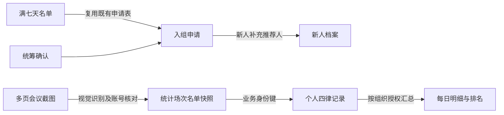
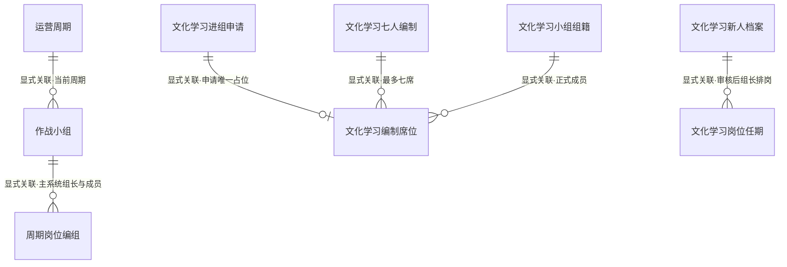
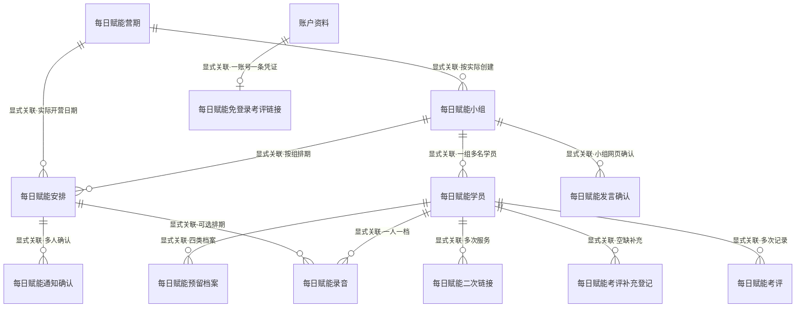
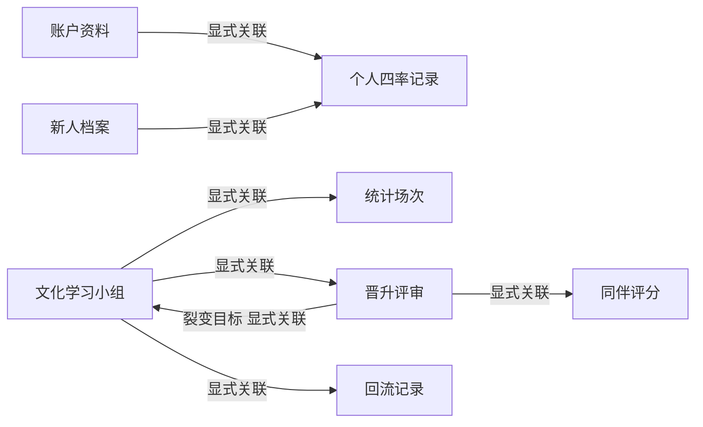

# 蝶变践行数据库结构与关联关系说明

## 签到默认出镜、截图扣除未开镜（2026-09-08 V34）

Zion Schema `yAqdvREoobe`；前端 `culture-conference-20260908-v263`。没有新增表、列、外键或唯一约束。

- Excel 签到名单按已录入系统账号匹配，清单外人员自动忽略；有签到状态或时间列时，仅有效签到记录纳入。姓名重复、状态不明确需核对。
- `culture_learning_metric_session.roster_json` 新增 JSON 业务字段 `attendanceCompleted`（该人员本次是否签到）和 `calculationMode=ATTENDANCE_MINUS_CAMERA_OFF`（按签到减去未开镜例外）。`cameraState` 为最终出镜状态，`cameraEvidence` 只保留本账号的例外依据。
- `culture_learning_person_record` 的签到与出镜在一次原子批量写入中更新；已签到默认出镜，截图证实关闭摄像头者扣除，未签到者不计出镜。补传截图只读取同日同组已存签到并更新出镜。
- `unique_culture_metric_session_key` 与 `unique_culture_person_record_key` 保持原定义；同组同日重复提交更新原记录，不新增重复统计机会。历史数据保持原值，不追溯重算。
- 图片归属仍通过 `CULTURE_IMAGE_PREPARE` 核验；`evidence_image_id` 为首图显式关联，JSON 内图片 ID 与 `memberKey` 为业务推断关联。每张图须有完成识别的页码回执，允许清晰会议图没有已录入账号例外时返回空数组。
- 智能体 `pf4i0rusc` 仅识别授权账号的未开镜例外；摄像头划线或明确关闭视频为 off，麦克风静音和头像本身不能证明关闭；同名或模糊状态待核对。只过滤识别结果，不删除账号或组籍。
- 数据总监负责提交；会员、组长、班长、营长、统筹、总指挥和总经理继续按原权限查看。改进的一致性措施是签到与出镜同事务写入，以及补传时按日期、小组匹配签到。

代码：`backend/actionflows/culture_learning_rules.js`；审查目录：`output/culture-conference-20260908/`。

## 文化学习名单、出镜识别与排名（2026-09-07 V33，功能审查通过）

本次没有增加或删除数据库表、列、外键和唯一约束。Zion 正式版 Schema `7XNwlo1BBNZ`，行为流版本 `culture-account-metrics-20260907-v33`；前端版本 `culture-account-metrics-20260907-v261`。184 项自动测试、真实视觉服务和实际页面联调通过，部署状态见项目功能审查报告。

- `culture_learning_join_application`：数据总监提交已满七天的姓名、手机号名单，申请编号前缀 `CL7LIST-`，`seven_days_verified=true`、`source_complete=false`。不伪造每日出勤。统筹确认接收小组后，新人通过通用链接补充推荐人及账号资料，复用同一申请并标记 `source_complete=true`。
- `culture_learning_metric_session.roster_json`：完整应到名单快照增加 `accountCode`、`evidenceImageIds`、`cameraState` 和 `cameraEvidence`。识别证据包含 `imageId`、`page`、`label`、`memberKey`、`state`、`evidence`。这些是 JSON 内的业务字段，不是新增列。
- `evidenceImageIds` 和 `cameraEvidence.imageId` 到图片表为业务推断关联，服务端逐图校验上传人；原有 `evidence_image_id` 仍为首张凭证的显式关联。同内容多页保留页序。`memberKey` 到账号或新人也是业务推断，必须由服务端匹配授权名册。
- `culture_learning_person_record`：按组、日期、指标、账号的既有唯一键保存每人完成/未完成记录。每日明细依据当日快照，缺失人员记录显示待核验。没有更改 `unique_culture_person_record_key` 和 `unique_culture_metric_session_key`。
- `culture_learning_audit_log`：复用 `CULTURE_IMAGE_PREPARE` 记录校验图片归属，名单与指标保存继续记录操作人和结果；测试不得覆盖真实签到数据。
- 独立 ZAI 配置 `pf4i0rusc`（文化学习会议截图出镜识别），模型 `google/gemini-3-flash`。图片参数 `pzrh4gm89`，文字参数 `ie5tmfjw8`。返回逐人 JSON，摄像头划线或关闭记为 off，麦克风划线不等同关镜，低置信度待核对。重复页按账号合并，出现 off 不计出镜。此配置不修改原微信图片识别服务。
- 每日明细继续按组织授权：组长本组、班长本班、营长本营、统筹授权范围，总经理/数据总监/总指挥全体。营长、统筹及全局管理角色的班级/小组/个人排名可比较全体，仅返回排名所需信息。组员查看本组榜与本人全体名次、四律及组内得分占比；组长和班长比较上级范围，自己的组织标红。全体榜前三名及倒数三名标红，无完整四律时不虚构名次。

源文件：`backend/actionflows/culture_learning_rules.js`、`backend/actionflows/manage_culture_learning.js`、`sites-mobile-app/public/culture-camera-review.js`。功能审查记录见项目内 `output/culture-account-metrics-20260907/功能审查.md`。

## 历史：文化学习规则与权限（2026-09-05 V30）

本节为当前生效口径，下面 V4/V6 等旧版章节仅作为历史记录，发生冲突时以本节及 V29 新表说明为准。本次未增加、删除或变更表、字段、外键和唯一约束。

- 小组编制为1位组长＋最多7位组员，总容量8人；七岗由组员轮换。新人连续七天实际签到由数据总监核验并提交名单，A/B统筹按授权范围确认入组、满员改配。既有通用新人链接仍保留；新人工作台以姓名＋登记手机号核对身份，旧用户名仅兼容旧页面。
- 总经理、数据总监、总指挥查看全局文化学习数据；总指挥保持管理操作只读。A/B统筹及总统筹沿用统筹审核权限，有明确组织任命时限制在该范围，未单独配置时沿用跨组审核范围。班长、营长仅能查看有效任命对应的班/营及其下属小组，未配置范围时返回空数据，不能扩展为全局。
- 组长仅管理本组；普通组员仅看本人四率、本人作业和所在小组名册。当期数据执委按本人真实岗位可登记本组分享；此规则同时覆盖已关联正式账号及仍使用新人身份的组员。新人不能借用同组其他人的数据执委岗位，不能登记大会签到或越组写入。
- `profile:<id>` 与 `newcomer:<id>` 是服务端推导的业务身份键，不是新增数据库外键。新人工作台使用完整 `selfKey` 绑定本人作业与履职表单，避免多个未关联账号的新人都使用 profileId=0 时串人。
- 四率为签到率、出镜率、小组分享率、作业提交率；未开展分享不计分母，缺失记录显示待记录。组长人工移回保留原小组、操作组长、时间及全部旧记录；允许之后重新学习七天申请，不启用70%自动移出阈值。
- 晋升仍执行七岗完整履职、其他成员评分、组长平均分至少80且最高、统筹确认，以及五个裂变组分别留存至少80%、好评至少80%。总经理预览新增普通统筹入口，预览不赋予该身份的操作权限。
- 文化学习22张业务表继续禁止普通客户端直接读写，统一由 `86a0fac5-5130-4775-8fa9-0d31dbe62ef5` 行为流校验身份、岗位和范围。当前后台版本 `culture-role-audit-20260905-v30`，静态页面版本 `culture-role-audit-20260905-v257`。

更新时间：2026-09-04  
当前每日赋能行为流版本：`daily-empowerment-contributor-form-20260818-v188`

## 历史：四绿中文化学习管理 V6（2026-09-03）

本模块以主系统当前 `operation_cycle`、`battle_group`、`cycle_position_assignment` 为组长与小组权威关系。新人主链固定为：数据总监或总经理生成不绑定组长和小组的单次链接 → 新人只填姓名、电话、推荐人 → 系统生成唯一 `portal_username` 并长期保留申请 → A/B 统筹核对推荐人的当前组织关系并锁定七人编制席位 → 归属组长为已审核新人分配当期七岗岗位 → 新人用长期用户名和登记手机号查看组织、岗位职责和执行清单。新人没有选择组长、小组或岗位的权限；未通过统筹审核时，长期入口只返回审核状态。

### 独立表与用途

- 规则和组织：`culture_learning_period`、`culture_learning_org_unit`。
- 身份和范围：`culture_learning_position_assignment`。学习岗位与 `account_profile.role_code` 分离；新增 `CLASS_LEADER`（班长）、`CAMP_LEADER`（营长），并支持 `LEARNER`、`GROUP_LEADER`、`COORDINATOR`、`DATA_DIRECTOR`。任命记录关联账号、学习期和授权组织节点。
- 新人进组：`culture_learning_newcomer`、`culture_learning_transition_attendance`、`culture_learning_join_application`、`culture_learning_join_approval`、`culture_learning_group_qr_code`。数据总监提交满七天名单时只要求姓名，手机号可由新人打开统筹确认后的链接再补充；待补期间 `normalized_phone` 使用 `PENDING-CULTURE-*` 内部唯一键，页面统一显示“手机号待补”，补交后原子替换为正式手机号。`culture_learning_newcomer.portal_username` 是新人长期入口的唯一用户名，与正式 `normalized_phone` 组合核验本人；手机号不在工作台回包中展示，唯一手机号约束继续生效。
- 七人编制：`culture_learning_group_membership`、`culture_learning_roster_snapshot`、`culture_learning_roster_seat`。`culture_learning_roster_seat.reservation_application_id` 是到进组申请的显式外键；唯一约束 `unique_culture_roster_seat_reservation_application` 保证一份申请最多锁一个席位，原有 `(roster_id, seat_no)` 唯一约束保证同一编制不重复席位。
- 七岗履职：`culture_learning_duty_catalog`、`culture_learning_duty_assignment`、`culture_learning_duty_completion`、`culture_learning_duty_evidence`。岗位目录按《3.0小组运营标准化手册》保存七岗说明、每日动作与执行清单；`culture_learning_duty_assignment.newcomer_id` 显式关联新人档案。轮换路径为宣传 → 会务 → 时间郎 → 作业 → 数据 → 纪律 → 主持，每岗 3–5 天。
- 数据和审计：`culture_learning_daily_metric`、`culture_learning_audit_log`。四率分别保存出勤率、出镜率、小组分享率、作业率；另保留岗位履职率和成长率。审计保存操作账号、组织范围、前后 JSON、原因和结果。

### 权限与读取边界

`四绿中文化学习安全管理` Actionflow（ID：`86a0fac5-5130-4775-8fa9-0d31dbe62ef5`）以当前 JWT 对应账号为管理端唯一身份来源。数据总监和总经理生成通用新人链接；A/B 统筹确认归属；只有归属组长可为已审核新人分配当期岗位，不可审核、改归属或发链接；总指挥、营长、班长和总经理按组织范围查看。新人长期登录只接受 `username` 和 `phone`；未审核时只返回审核进度，审核通过后才返回组织、岗位职责与流程。

### 文化学习关键关系图

### 新增字段、关联与约束

| 来源表 | 目标表 | 目标外键 | 类型 | 业务用途 |
| --- | --- | --- | --- | --- |
| `culture_learning_join_application` | `culture_learning_roster_seat` | `reservation_application_id` | 显式一对多；目标外键唯一 | 每份进组申请最多持有一个可追踪席位，驳回时按申请精确释放 |
| `culture_learning_newcomer` | `culture_learning_duty_assignment` | `newcomer_id` | 显式一对多 | 在正式组籍建立前保留新人的历次轮岗任期 |

- `culture_learning_roster_seat.reservation_application_id`：可空显式外键；运营核验成功前先以申请 ID 锁位，重复请求只命中原席位。
- `culture_learning_roster_seat.seat_status`：本流程使用 `RESERVED`、`OCCUPIED`、`AVAILABLE`；只允许期望状态条件更新，避免迟到请求复活申请。
- 唯一约束：`unique_culture_roster_seat_reservation_application(reservation_application_id)`；PostgreSQL 允许多条空值，因此释放后的空闲席位可继续复用。
- 唯一约束：`unique_culture_learning_newcomer_portal_username(portal_username)`；用户名不随申请链接过期而失效。
- 主系统 `cycle_position_assignment.leader_assignment_id` 到文化学习组节点是业务映射；Zion 内通过 `MAIN-CYCLE-*`、`MAIN-BATTLE-GROUP-*`、`MAIN-LEADER-*` 编码留存来源，不伪造跨表外键。

2026-09-02 已执行 Zion Sync Backend，最终 Schema ID 为 `ZbEg7GN0P2P`，申请占位关系补丁 ID 为 `1bJJv85AzrE`，V14 行为流补丁 ID 为 `v2OONwxq0dV`。同步后烟测识别当前主周期、62 个组长岗位与 23 个可用组长候选；申请席位关系可查询，无效链接、错误手机号、未满 7 天、非组长生成链接和账号错配均被服务端拒绝。烟测未创建新人申请，待处理申请数保持 0。

2026-09-03 V23 长期新人工作台已执行 Zion Sync Backend，部署 Schema ID 为 `q8zA540Pvjq`，行为流补丁 ID 为 `w2OON7BqemY`，类型检查无错误。已幂等补齐 2 条历史新人用户名，未改变新人、申请和岗位任期数量；已审核账号可读取组织与七岗路径，待审账号仅返回审核进度。

2026-09-03 V24 编制读取修复已执行 Zion Sync Backend，部署 Schema ID 为 `r725G8DJvXZ`，行为流补丁 ID 为 `rvEEM6ernqo`，类型检查无错误。小组人数统一按主系统当前周期的组长、直属成员、文化学习活动组籍和有效申请席位合并去重；全链烟测已完成通用链接、三项资料、待审隔离、统筹通过、组长排岗和新人工作台登录。测试数据已精确清理，刘曜恺小组恢复真实 `3/7`，各业务表总数恢复测试前数值。

### 统筹成员岗位看板 V26（2026-09-04）

已同步 Zion schema `o0DY56wrrPD`，校验无错误。线上 A/B 统筹、组长、总经理、总指挥和数据总监只读验收通过，成员/申请/任期/编组记录读前读后散列一致。

`manage_culture_learning` 的只读 `load` 返回新增 `groupMembers`，不新增数据库表、字段、索引或外键，不回写成员、审核或任期。前端 `learning-center-v1.html` 优先展示该明细，原有 `members` 回包保留兼容。

- 人员来源：主系统当前周期 `cycle_position_assignment` 的组长与直属成员，合并有效 `culture_learning_group_membership`，以及最新申请已审核的 `culture_learning_newcomer`。同组按 `profile_id` 去重；尚无正式账号的新人按新人 ID 去重。待审核或已驳回申请不计入已关联组员。
- `groupId / groupName / className / leaderName`：服务端已授权 `groups` 与主系统组长关系；`MAIN-LEADER-{profileId}` 到文化小组为业务映射，不是新增外键。
- `position`：组织职位，来自当前主系统组长关系或有效 `culture_learning_position_assignment.position_name`；无任命时显示组员／新人组员。
- `duty / dutyStatus / startsOn / endsOn`：七岗与任期，使用既有 `culture_learning_duty_assignment.membership_id` 或 `newcomer_id` 显式关系联到人，再通过 `duty_id` 联到 `culture_learning_duty_catalog`。优先当前有效任期，其次未来安排，最后最近结束岗位；取消记录不显示。
- `servedDays`：按中国日期从 `starts_on` 首日计 1 天，封顶 `ends_on` 和 `term_days`；未来或计划岗位为 0，日期缺失／无效时为空，不推断真实任职。
- `completedDays`：`culture_learning_duty_completion` 中本任期 `COMPLETED / CONFIRMED` 的日期去重数，与任职自然日不同。`asOfDate` 是服务端统计日期。
- 明细只在已经授权的小组集合中生成，不接受客户端传入组织范围，不返回电话。A/B 统筹目前沿用未绑定文化组织根节点时的既有全局配置；组长仅其授权小组。此版本不修改权限配置。

姓名登录补充（V25）：新人当前页面只提交申请姓名 `name` 和登记手机号 `phone`，审核后进入本人工作台。`portal_username` 仅保留历史记录及旧缓存 API 兼容，不再要求新人填写用户名；上文 V23 的用户名入口说明为历史设计。

### 微信群二维码与灵活轮岗 V27（2026-09-04，前端发布暂缓）

后端 `culture-learning-qr-duty-rotation-20260904-v27` 已同步；前端 v253 已实现并同步发布副本，但安全审查未通过，未推送或发布 Zeabur。下述行为流边界不等于数据库直接访问已安全隔离：审查确认二维码表、岗位任期表的历史 Anonymous / Logged-in 及其他角色配置存在宽泛 CRUD 权限，需在 Zion 管理后台收紧并重新烟测后再发布。不能只靠按钮隐藏和行为流角色校验保证安全。

- `culture_learning_group_qr_code.wechat_image`：新增可空 IMAGE，写入使用生成的 `wechat_image_id`，读取 `wechat_image { url }`。沿用 `group_id`、`uploaded_by_id` 显式关联。`prepare-group-qr` 校验组长和授权小组后，原生 MD5 预签名申请私有图片并创建 `WECHAT_UPLOAD_PENDING`；原始字节 PUT 成功后 `save-group-qr` 激活为 `WECHAT_ACTIVE`。不会把 `join-invite://` 新人登记链接当成微信群码。每次上传追加版本；选最新激活版本，过期不回退旧码。待审核新人工作台不返回二维码或岗位。
- `culture_learning_duty_assignment` 新增 `ended_at TIMESTAMPTZ`（实际结束时间）、`slot_no BIGINT`（岗位槽位1/2）、`rotation_key TEXT`、`request_key TEXT`，均可空兼容旧记录。`ends_on` 保留原定结束日，提前轮换另记 `ended_at`，不会重写原任期天数或删除历史记录。
- 新增显式一对多关系：`account_profile.culture_duty_assignments → duty_assignment.profile`，生成 `profile_id`；`culture_learning_org_unit.duty_assignments → duty_assignment.group`，生成 `group_id`。正式固定组员可直接按账号与小组排岗，不需要伪造新人档案或组籍；旧 `membership_id/newcomer_id` 继续兼容。
- 新增唯一约束 `culture_duty_rotation_key_unique(rotation_key)`、`culture_duty_request_key_unique(request_key)`。前序校验键采用服务端成员键与最新任期ID组合，两份兼岗共享版本，避免并发挤出第三岗；请求键用于安全重试去重。不是外键，不代替上述显式关系。
- 组长选择3/4/5天，首次排岗、新增兼岗、替换具体当期岗位三种操作。最多两岗；替换只结束选中的任期；新的岗位开始日按中国当天重新计算。传入成员必须属于服务端授权小组，未审核新人、无效岗位、第三岗、重复兼岗和陈旧版本拒绝。
- `load.groupMembers` 与新人工作台共享 `currentDuties[]`、`dutyHistory[]` 投影；保留旧单岗位字段兼容缓存。历史含岗位、原定起止、实际结束、任职自然日和安排人。页面每30秒、恢复可见时或手动刷新同步；编辑中的组长表单暂缓自动刷新，保存后重新加载。
- 自动测试122项通过。隔离测试组完成私有图片预签名、PUT、激活和URL读取；通用链接→三项资料→待审→统筹通过→组长排岗→兼岗→单岗轮换→新人登录全链路通过。测试记录精确清理；原成员/申请/任期/主系统编组记录散列一致。未测试真实微信群加入（尚无真实微信群码）。

## 每日赋能模块边界

每日赋能是独立服务模块，不复用原会员账号主档、作战小组、组员199收入等业务表。营期、学员、共同考评、补充登记、录音和档案只保存账号快照，不级联绑定账号；唯一例外是旧版免登录考评凭证表与 `account_profile` 建立一对一显式关系。删除或停用账号不会删除营期、学员、排期、通知、考评、补充登记、录音、二次链接或档案历史。

## 关系图

## 表分组

- 组织结构：`daily_empowerment_camp`、`daily_empowerment_group`、`daily_empowerment_student`
- 赋能执行：`daily_empowerment_schedule`、`daily_empowerment_notification`、`daily_empowerment_speaking_confirmation`、`daily_empowerment_speaking_order`
- 服务记录：`daily_empowerment_evaluation`、`daily_empowerment_evaluation_supplement`、`daily_empowerment_recording`、`daily_empowerment_followup`
- 安全入口：`daily_empowerment_evaluation_access_link`
- 后续档案：`daily_empowerment_archive`
- 汇总台账：不另建重复表，由以上模块实时汇总已创建小组的预约中、已处理、已预约完成和总结状态。

## 关键关联清单

| 来源表 | 目标表 | 关系 | 目标外键 | 类型 |
| --- | --- | --- | --- | --- |
| `daily_empowerment_camp` | `daily_empowerment_group` | 一个营包含多个小组 | `camp_id` | 显式关联 |
| `daily_empowerment_camp` | `daily_empowerment_schedule` | 一个营包含多条赋能安排 | `camp_id` | 显式关联 |
| `daily_empowerment_group` | `daily_empowerment_student` | 一个小组包含多名学员 | `empowerment_group_id` | 显式关联 |
| `daily_empowerment_group` | `daily_empowerment_schedule` | 一个小组可有多次安排 | `group_id` | 显式关联 |
| `daily_empowerment_group` | `daily_empowerment_speaking_confirmation` | 一个小组可有多次网页确认历史 | `empowerment_group_id` | 显式关联 |
| `daily_empowerment_schedule` | `daily_empowerment_notification` | 一次安排通知多个角色 | `schedule_id` | 显式关联 |
| `daily_empowerment_schedule` | `daily_empowerment_recording` | 录音可归属一次安排 | `schedule_id` | 显式关联 |
| `daily_empowerment_student` | `daily_empowerment_evaluation` | 学员可有多次考评 | `student_id` | 显式关联 |
| `daily_empowerment_student` | `daily_empowerment_evaluation_supplement` | 学员每天可由多名授权人员补充空缺信息 | `student_id` | 显式关联 |
| `daily_empowerment_student` | `daily_empowerment_recording` | 学员可有多次录音 | `student_id` | 显式关联 |
| `daily_empowerment_student` | `daily_empowerment_followup` | 学员可有多次链接 | `student_id` | 显式关联 |
| `daily_empowerment_student` | `daily_empowerment_archive` | 学员可有多类档案 | `student_id` | 显式关联 |
| `account_profile` | `daily_empowerment_evaluation_access_link` | 一个授权账号最多一条免登录凭证 | `evaluator_profile_id` | 显式一对一关联 |
| 每日赋能记录 | `account_profile` | 保存操作者姓名、角色、账号编号快照 | 无 | 业务推断，刻意不建外键 |

## 各表用途与字段

### `daily_empowerment_camp`：每日赋能营期

用途：保存按实际业务创建的21天营组织信息和真实开营状态。当前已有 `839营` 与 `837营`，授权身份可在“组织与开营”中继续添加营；营编号可按月修改，营数量和每营小组数量均不预设。未开营时服务端禁止建立赋能安排。

- `camp_code`：可编辑营编号；纯数字输入由服务端统一规范为“数字+营”。修改编号只用于当期纠错，新一期必须新建营期记录，不得复用旧 `camp_id`。
- `camp_name`：营名称。
- `camp_leader_name`、`class_leader_name`：营长和副营长的选填辅助信息，不参与排期判断。`class_leader_name` 仅保留为兼容历史数据的 API 字段名，对外统一显示“副营长”。
- `duration_days`：营期天数，当前固定21。
- `opening_date`、`closing_date`：实际开营和结营日期，不默认每天生成任务。
- `is_open`：是否正式开营；是赋能排期的服务端前置条件。
- `is_active`：营期是否启用。
- `notes`、`source_version`：备注和数据版本。
- 唯一约束：`unique_daily_empowerment_camp_code(camp_code)`。

### `daily_empowerment_group`：每日赋能小组

用途：按数据总监实际录入的小组保存组织、人数、199结构和台账状态。小组是最小服务单位；不预建10组或20组占位记录，组号不决定赋能先后。

- 原有核心字段：`group_code`、`camp_name`、`class_name`、`group_name`、`member_count`、`analyst_count`、`member_199_count`、三次缴费人数、三类来源人数、资料完成与原进组状态。
- 新增字段：`group_leader_name`、`group_leader_phone`、`organization_status`、`ledger_status`、`summary_status`。组长电话只用于网页入口双项核验，不与主页面登录账号或 `account_profile.phone_identity` 绑定。
- `camp_id`：由营期到小组的显式关系自动生成。
- 唯一约束：`unique_daily_empowerment_group_camp_code(camp_id, group_code)`，同一营内不得重复，不同营可使用相同小组编号。

### `daily_empowerment_speaking_confirmation`：每日赋能发言确认

用途：直接绑定已录入的小组，保存两小时网页链接、冻结名单及组长提交结果；`empowerment_schedule_id` 只作为可选时间关系，不再决定小组是否显示。所有资料已完成且尚未赋能完成的小组都会进入生成列表。公开页初次打开只返回营班组和有效期，组长姓名、电话同时匹配后才返回学员姓名、主持人选项和排序项。组长可确认自己主持或指定本组学员主持，服务端根据组长资料与冻结名单推导主持人姓名，并把主持人、主持稿路径和发言顺序一同保存到 `submission_result`。所有有效跳转链接都提供独立主持稿 PDF，提交时服务端再次核验。

- `empowerment_group_id`：小组主外键；既有记录仍可通过可选 `empowerment_schedule_id` 兼容读取。
- `active_schedule_key`：保留历史 API 名称，新记录写入 `G:<groupId>`，保证同一小组只有一个活动链接。
- `submission_result.host`：JSONB 内的主持人结果，包含 `type`、服务端推导的 `name`、可选发言条目 ID 与学员 ID；历史提交没有该对象时只读页面显示“历史记录未确认主持人”。
- `submission_result.host_script_url`：本次确认使用的主持稿静态路径，不与学员、账号或录音数据绑定。

### `daily_empowerment_student`：每日赋能学员

用途：按小组保存姓名、联系电话、身份、新人标记、分析师学习次数、199缴费次数、干部赠送、表现优秀转入、四率优秀转入和参加次数。

- `empowerment_group_id`：显式关联所属小组。
- `seat_no`、`student_name`、`phone`：组内序号和基础信息。草稿允许电话待补，后端使用不可见的组内唯一占位键落库，页面读取时还原为空；小组标记完成前必须补齐每人 11 位手机号。
- `student_identity`、`analyst_learning_sessions`：学员/分析师及学习次数。
- `is_newcomer`：是否新人；用于按小组实时计算新人数量和新人比例，为数据总监排期提供参考。
- `is_199_member`、`payment_status`、`payment_count`：199身份和缴费情况。
- `is_cadre_gift`、`is_good_performance_transfer`、`is_four_rate_transfer`：来源分类。
- `attendance_sequence`、`is_active`、`student_notes`：参加第几次、当前在组状态和备注。
- 唯一约束：`unique_daily_empowerment_student_group_phone(empowerment_group_id, phone)`；防止同组真实手机号重复，缺电话草稿由行为流按座位生成内部唯一键。
- 学员一经落库，前端后续保存必须携带稳定 `student_id`；修正姓名或联系电话时更新同一主档，不再以新电话新建一个学员，从而保证考评、录音、二次链接和档案的历史关系不断裂。
- 同一期营内以联系电话识别同一学员：同组重复保存会更新原主档，跨组发现相同联系电话时由同步行为流拒绝保存并提示原小组；不同营期允许再次建档和参加课程。表级唯一约束继续保护同组写入，跨组同营规则由行为流事务校验。

### `daily_empowerment_schedule`：赋能安排

用途：保存实际日期、时间、营、小组、老师、会议、确认开关和激活状态。

- `schedule_date`、`start_time`、`end_time`：实际赋能时间，不自动默认每天安排。
- `camp_id`、`group_id`：显式关联营期和小组。
- `teacher_name`、`meeting_room`、`meeting_link`：老师与会议资料。
- `schedule_status`、`is_active`、`manager_confirmed`：草稿/待确认/激活状态。
- `confirmed_by`、`confirmed_at`：确认人快照和确认时间。
- `reminder_hours`：保留的历史兼容字段；当前通知在王奕晴确认赋能时立即生成，不再按收件人未确认循环提醒。
- `notes`、`source_version`：安排备注和版本。
- 同一小组的同日、同开始/结束时间段在保存前由同步行为流查重；确认激活时会重新校验营期开关、营期日期、小组所属营和学员资料完成状态。

### `daily_empowerment_notification`：赋能提醒

用途：只有数据总监王奕晴（`DATA0001`）确认赋能后，系统才按已启用的真实管理账号逐人生成通知，用于告知所有人明早去哪个营、班、组赋能。收件人只需查看，无需再确认收到或激活。

- `schedule_id`：显式关联赋能安排。
- `recipient_role_code`、`recipient_name`、`recipient_account_code`：分别保存通知对象职责、真实人名和账号编号快照；页面显示“人名 · 中文职责”，不显示内部英文角色码。
- `delivery_status`、`received_confirmed`、`received_at`：保留历史通知状态；当前规则不要求收件人确认。
- `reminder_hours`、`next_reminder_at`、`last_reminded_at`、`reminder_count`、`reminder_enabled`：保留通知生成时间与历史兼容数据；确认赋能后一次性展示提醒。
- 唯一约束：`unique_daily_empowerment_notification_recipient(schedule_id, recipient_role_code, recipient_account_code)`。
- 同一职责有多个已启用账号时，每人生成一条独立通知；任何收件人都不需确认收到。尚未创建账号的职责不会生成虚假收件人，页面会单列“待配置通知账号”。

### `daily_empowerment_evaluation`：学员考评

用途：保存A/B/C学习状态、四类问题、主动意愿、老师输出、学生接受程度、计划沟通次数和每次互动依据；一名学员可有多条历史记录，并在个人赋能详情台账中按时间持续呈现。

- `student_id`：显式关联学员。
- `evaluation_level`：A/B/C学习状态。
- `primary_problem_category`：主要问题分类。
- `has_child_problem`、`has_growth_problem`、`has_business_problem`、`has_couple_problem`：亲子关系、个人成长、企业问题和夫妻关系，可多选。
- `communication_sequence`、`evaluation_basis`、`interaction_notes`：沟通次数、考评依据和互动详情；沟通次数由考评人按实际轮次从第1—99次中选择。
- `willingness_score`：兼容旧数据的主动意愿整数代表值；新记录的准确档位以 `willingness_percentage_band` 为准。
- `willingness_percentage_band`：主动意愿百分比区间，只允许八档：100%—95%、95%—90%、90%—85%、85%—80%、80%—75%、75%—70%、70%—65%、65%—60%。
- `empowerment_topic_detail`：赋能板块的详细说明，例如“企业问题·农具设备合作社”或“亲子关系”。
- `teacher_output_score`、`student_acceptance_score`：兼容旧数据的整数代表值，不作为新页面的自由数字输入。
- `teacher_output_percentage_band`、`student_acceptance_percentage_band`：老师输出和学生接受程度的准确百分比区间，使用与本轮考评相同的八档选项。
- `followup_min_times`、`followup_max_times`：计划二次沟通的最少和最多次数，例如3—5次、5—7次；该值是考评当时的原始计划快照，不随执行进度改写。
- `evaluator_name`：记录人姓名快照。
- `evaluator_role`、`evaluator_phone`：独立链接填写人的身份和电话快照。
- `target_identity`：学员身份，支持老板、高管/其他两类分支。
- `employee_count_range`、`profitability_status`：老板分支的员工数量和盈利情况。
- `economic_target_wan`、`target_achievement_percentage`：高管/其他分支的经济目标（万）和当前目标实现比例。
- `true_culture_recognition`、`teacher_experience`、`course_content_absorption_score`：真文化认可度、老师学习年限、课程内容吸收度（0—10分）。
- `is_confirmed`、`confirmed_at`、`visibility_status`：确认后相关角色可见。
- `evaluated_at`：考评业务时间。
- `communication_sequence` 由考评人明确选择实际沟通轮次；同一学员、同一轮的三位考评人必须选择相同次数，考评与同表单上传的小组互动录音共用这一编号。只有已确认考评会开启新的计划沟通周期，草稿不切断前一周期。

### `daily_empowerment_evaluation_access_link`：免登录考评凭证

用途：为总指挥、统筹及指定评分账号生成各自独立的免登录链接。链接只识别绑定账号，页面不能切换身份；后台仍按该账号原有权限返回当天赋能对象、考评和一对一处理功能。

- `evaluator_profile_id`：显式一对一关联 `account_profile.id`，一账号最多一条当前凭证。
- `token_digest`：原始随机凭证的 SHA-256 摘要；数据库和文档均不保存可直接使用的原始凭证。
- `link_status`、`expires_at`、`revoked_at`：启用、可选失效和撤销信息。
- `opened_at`、`last_used_at`：首次打开与最后使用审计时间。
- `created_by_account_code`、`source_version`：生成账号快照和数据版本。
- 唯一约束：`unique_daily_evaluation_access_token(token_digest)`。重新生成会替换摘要，使旧链接立即失效。
- 匿名页面只可通过公开窄代理调用主安全行为流；允许操作限于考评、当天确认和该账号原本可处理的一对一事项，不开放营期、小组或其他后台维护。

### `daily_empowerment_evaluation_supplement`：独立考评补充登记

用途：供总指挥、统筹和其他获准人员从固定独立链接补充学员身份、认可度及互动记录。该表与三位指定老师共同评分的 `daily_empowerment_evaluation` 分离，因此补充登记不新增沟通次数，也不参与最少/最多沟通次数的三账号中间值测算。

- `student_id`：显式关联 `daily_empowerment_student.id`；独立页面先搜索原有学员，找不到时才按营、班、组、姓名、手机号创建学员。
- `contribution_date`：按中国时区保存补充日期；同一天后续填写人读取该学员已有补充内容。
- `evaluator_identity_category`、`evaluator_name`、`evaluator_phone`、`evaluator_role_code`：填写人选择身份和服务端核验后的账号快照。总指挥、统筹按账号职责核验；“其他人”仅覆盖组长、成员及既有每日赋能管理岗位，不接受未知角色。姓名、手机号与启用中的 `account_profile` 必须匹配；与账号表之间为业务推断，不建立外键。
- `target_identity`、`employee_count_range`、`profitability_status`、`economic_target_wan`、`target_achievement_percentage`：学员身份及老板/高管分支信息，均为选填。
- `true_culture_recognition`、`teacher_experience`、`course_content_absorption_score`：真文化认可度、学习年限和0—10分吸收度，均为选填。
- `interaction_notes`：按填写人追加的互动详细记录，不覆盖先前记录。
- `source_version`：当前为 `DAILY_EVALUATION_SUPPLEMENT_V1`。
- 无删除型唯一约束。服务端按“学员 + 中国日期”聚合，任何已经存在的字段都只读锁定；新提交只能填补空值，无法覆盖历史内容。

### `daily_empowerment_recording`：录音与交流文档

用途：手机录音上传后绑定学员个人档案；支持小组互动和一对一、一次和多次沟通。

- `student_id`：必选显式关联学员。
- `schedule_id`：可选显式关联赋能安排。
- `recording_file_id`：Zion私有文件ID，由FILE字段自动生成。
- `communication_sequence`、`communication_type`：第几次沟通及小组/一对一类型。
- 独立“录音与交流文档”填写入口已取消：小组互动录音在考评登记中上传，一对一录音在一对一安排中上传。页面只展示后台预估编号，不提供次数或类型手填控件。
- 一对一录音保存时，后台优先查找该学员最新一条尚未绑定一对一录音的安排并沿用其 `communication_sequence`；没有待绑定安排时，才按全部历史记录最大编号加1。录音保存后，录音时间轴、个人赋能台账和一对一安排状态读取同一条记录同步更新。
- `file_name`、`file_mime`、`file_size`：原文件元数据。
- `transcript_text`、`corrected_text`、`document_text`：自动识别稿、人工校对稿和交流文档。
- `recognition_status`、`uploader_name`、`recorded_at`、`notes`：识别状态、上传人快照、时间和备注。

### `daily_empowerment_followup`：二次及多次链接

用途：按企业问题、个人成长、夫妻关系、亲子关系顺序维护一对一服务和多次链接。

- `student_id`：显式关联学员。
- `problem_category`、`sort_order`、`route_code`：问题类别、1至4排序及G/H线路。
- `grade_level`、`score`：数据总监定级和评分。
- `appointment_date`、`appointment_time`、`teacher_name`：一对一日期、时间和老师。
- `willingness_status`、`no_service_reason`：学员意愿及未赋能原因。
- `followup_status`、`notification_status`：预约中、已预约、已处理、重新组织等状态。
- `communication_sequence`、`summary`、`next_action`：第几次链接、结论和下次行动。

计划沟通进度按学员关系实时计算：同一学员每新增一条 `daily_empowerment_followup` 记录即计为已记录1次，并从当前已确认考评的最少/最多计划数中各减1。例如原计划3—5次，保存第一条链接后显示“已记录1次，剩余2—4次”。新一轮已确认考评建立后，以该考评时间为新周期起点，草稿不切断周期；链接的 `communication_sequence` 同样由后台按该学员全部考评、录音和链接历史自动生成，页面不能手填。达到当前计划上限后必须先建立下一次考评计划。原始考评计划始终保留，方便审计。

### `daily_empowerment_archive`：四类问题档案

用途：按企业问题、个人成长、夫妻关系、亲子关系保留四类独立档案入口和学员关系，后续可继续拆分详细表格。

- `student_id`：显式关联学员。
- `archive_type`：当前使用 `BUSINESS`（企业问题）、`GROWTH`（个人成长）、`COUPLE`（夫妻关系）、`CHILD`（亲子关系）；历史数据中的 `PARENT`、`ENTERPRISE_REPORT`、`ENTERPRISE_ANALYSIS` 保留兼容读取。
- `archive_status`、`title`、`summary`：状态、标题和摘要。
- `content_json`：后续表格的结构化扩展内容。
- `reserved_entry`：是否为预留入口。
- `created_by`、`notes`：建档人快照和备注。

## 权限与历史连续性

> 当前确认规则（V15）：只有数据总监王奕晴（`DATA0001`）可以确认赋能。她确认后系统立即通知所有授权人员查看明早的营、班、组；其他人无需确认收到或再激活。下述共同维护权限不包含“确认赋能”。

- 共同维护身份：创始人（盛总）、预备董事长（赵展）、总运维（王总）、总指挥（杜建江）、总统筹A（索赞强）、总统筹B（张成国）、数据总监及总负责人。以上身份进入每日赋能端口后，对全部页面数据均可查看、填写、修改和确认。
- 身份与职责只用于工作分工和操作人快照，不再用于锁定页面编辑能力：数据总监主要维护组织、学员、排期及二次链接；创始人/总指挥主要确认安排；总统筹主要通知协同；总负责人主要考评及录音归档。
- “预备董事长、总运维、总统筹A/B”等为每日赋能模块内的职责映射，不改写人员在蝶变践行主系统中的原账号身份或历史业务关系。当前专属映射为：赵展→预备董事长、王总→总运维、索赞强→总统筹A、张成国→总统筹B、杜建江→总指挥。
- 开营、资料完整性、日期范围、必填项和数据格式等业务校验继续由服务端统一执行，不因共同编辑而放宽。
- 所有写操作都经过服务端行为流校验；未获准进入每日赋能端口的身份仍不能读取或维护数据。
- 独立补充考评链接不是后台页面副本，不要求再次登录；每次读取、搜索、新增学员和提交时都重新核验填写人所选身份、姓名及系统登记手机号。页面不返回学员手机号，考评字段全部选填。
- 账号关系采用业务快照，不使用级联删除外键，所以删号、重建账号不会破坏历史业务记录。

## 一致性与优化建议

- 当前提醒由王奕晴确认赋能后立即生成，工作台对当日及未来的已激活安排展示“明早赋能”营班组去向；如需微信或短信主动推送，应新增独立定时行为流，不要改变安排状态。
- 月报和动态小组台账由模块表聚合，避免维护重复汇总表造成口径不一致。
- 小组新人比例由有效学员的 `is_newcomer` 实时计算，不另存重复比例字段；人数、新人比例和199结构只作为数据总监判断依据，不自动决定执行顺序。
- `schedule_date + group_id + start_time` 可在业务稳定后增加唯一约束，防止相同小组同一时间重复排期。
- 录音自动识别需接入正式语音服务；未接入时保持 `UPLOADED`，不得伪造识别完成。

## 企业问题表格工具包 V3 数据源

### `enterprise_problem_tool_template`：企业问题工具模板

用途：保存参数设置、三笔账、四流自测、单品利润、库存周转、人流产能、现金流固定成本、一页诊断书、行动卡、复盘对比、分段验收和周看板十二套正式模板。`definition_json` 保存字段、默认参数和计算口径；`tool_code + workbook_version` 唯一约束防止同版本重复导入。

### `enterprise_problem_tool_record`：企业问题工具记录

用途：保存每次真实填写的输入 JSON、计算结果 JSON、结果摘要和工作簿版本。`enterprise_problem_case_id` 显式关联企业问题项目，`creator_profile_id` 显式关联填写人账户资料，`record_code` 全局唯一。

权限：匿名用户、合伙人、队长对两张表均无权限；普通已登录角色只读模板、只新增工具记录；总经理保留完整管理权限。应用层继续沿用每日赋能权限家族，总指挥保持只读，保存时必须核验当前 JWT、项目归属、填写人资料和模板启用状态。

## 2026-09-05 文化学习规则 V29（数据表与行为流已同步，功能审查通过）
新增五张独立表；原新人、出勤、申请、组籍、岗位任期继续保留。

### 文化学习个人四率记录 `culture_learning_person_record`
| 字段 | 用途 | 类型 |
|---|---|---|
| `record_key` | 唯一记录键 | TEXT |
| `member_key` | 成员标识 | TEXT |
| `metric_kind` | 指标类型 | TEXT |
| `learning_date` | 学习日期 | DATE |
| `completed` | 已完成 | BOOLEAN |
| `content` | 文字内容 | TEXT |
| `evidence_image` | 凭证图片 | IMAGE |
| `submitted_at` | 提交时间 | TIMESTAMPTZ |
| `source_type` | 来源 | TEXT |
| `status` | 状态 | TEXT |

### 文化学习统计场次 `culture_learning_metric_session`
| 字段 | 用途 | 类型 |
|---|---|---|
| `record_key` | 唯一记录键 | TEXT |
| `metric_kind` | 指标类型 | TEXT |
| `learning_date` | 学习日期 | DATE |
| `held` | 实际开展 | BOOLEAN |
| `roster_json` | 应参与人员快照 | JSONB |
| `evidence_image` | 大会截图 | IMAGE |
| `submitted_at` | 提交时间 | TIMESTAMPTZ |

### 文化学习晋升评审 `culture_learning_promotion`
| 字段 | 用途 | 类型 |
|---|---|---|
| `record_key` | 唯一记录键 | TEXT |
| `member_key` | 候选成员标识 | TEXT |
| `target_role` | 目标岗位 | TEXT |
| `status` | 评审状态 | TEXT |
| `electorate_json` | 评分人快照 | JSONB |
| `evidence_json` | 资格依据快照 | JSONB |
| `score` | 最终评分 | DECIMAL |
| `decided_at` | 确认时间 | TIMESTAMPTZ |

### 文化学习同伴评分 `culture_learning_peer_vote`
| 字段 | 用途 | 类型 |
|---|---|---|
| `record_key` | 唯一记录键 | TEXT |
| `voter_key` | 评分成员标识 | TEXT |
| `score` | 评分 | DECIMAL |
| `submitted_at` | 评分时间 | TIMESTAMPTZ |

### 文化学习回流记录 `culture_learning_return_record`
| 字段 | 用途 | 类型 |
|---|---|---|
| `record_key` | 唯一记录键 | TEXT |
| `member_key` | 成员标识 | TEXT |
| `member_name` | 成员姓名 | TEXT |
| `status` | 状态 | TEXT |
| `metrics_json` | 人工移回标识、操作人姓名等历史快照 | JSONB |
| `returned_at` | 回流时间 | TIMESTAMPTZ |
| `reason` | 回流说明 | TEXT |

显式关系（外键由 Zion 自动生成）：
- 文化学习组织节点 → 文化学习个人四率记录：`group_id`。
- 文化学习组织节点 → 文化学习统计场次：`group_id`。
- 文化学习组织节点 → 文化学习晋升评审：`group_id`。
- 文化学习组织节点 → 文化学习回流记录：`group_id`。
- 文化学习组织节点 → 文化学习晋升评审：`created_group_id`。
- 账户资料 → 文化学习个人四率记录：`actor_id`。
- 账户资料 → 文化学习个人四率记录：`profile_id`。
- 账户资料 → 文化学习统计场次：`actor_id`。
- 账户资料 → 文化学习晋升评审：`actor_id`。
- 账户资料 → 文化学习晋升评审：`profile_id`。
- 账户资料 → 文化学习回流记录：`actor_id`。
- 账户资料 → 文化学习回流记录：`profile_id`。
- 账户资料 → 文化学习同伴评分：`actor_id`。
- 文化学习新人档案 → 文化学习个人四率记录：`newcomer_id`。
- 文化学习新人档案 → 文化学习晋升评审：`newcomer_id`。
- 文化学习新人档案 → 文化学习回流记录：`newcomer_id`。
- 文化学习晋升评审 → 文化学习同伴评分：`promotion_id`。

唯一约束：
- `unique_culture_person_record_key`：文化学习个人四率记录的唯一记录键。
- `unique_culture_metric_session_key`：文化学习统计场次的唯一记录键。
- `unique_culture_promotion_key`：文化学习晋升评审的唯一记录键。
- `unique_culture_peer_vote_key`：文化学习同伴评分的唯一记录键。
- `unique_culture_return_key`：文化学习回流记录的唯一记录键。

成员标识及名册 JSON 为历史身份快照（业务推断，非外键），身份必须由服务器推导。日期按北京时间自然日。个人记录按小组/日期/指标/成员唯一，评分按评审/评分人唯一。未开展分享不计分母，缺数据不等于零分。人工移回保留操作人姓名快照、原小组、成员、时间和原因；不设置70%阈值，原四率、作业、任岗和申请记录不删除。

来源：`backend/schema/culture_learning_rules_v29.json`、`backend/actionflows/culture_learning_rules.js`。已确认：1位组长＋最多7位组员，总容量8人，七岗由组员轮换。连续7天以数据总监核对的逐日实际签到为依据。人工移回后允许重新申请，七天学习资格从移回时间重新核验。

V29 补充：晋升评审 → 岗位任命通过 `promotion_id` 显式关联，`unique_culture_promotion_appointment` 保证一次评审只任命一次。文化学习22张业务表对匿名及所有普通权限角色关闭直接增删改查，通过行为流核验登录身份、所属组和评分资格后读写；其他业务模块权限不变。大会名单可一次登记授权范围内所有小组，组级四率按真实人次汇总；未开展分享不计分母。裂变班长按去重的历来成员与当前在组成员核验每组80%留存，评分人排除候选人自身。
