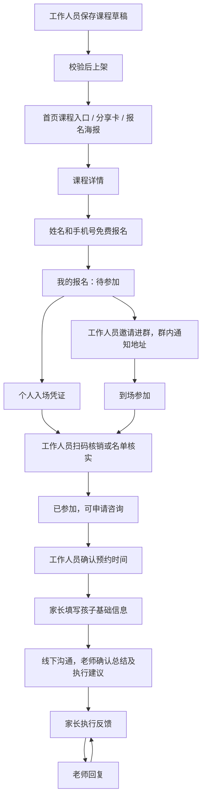

# 课程报名参考与适配方案

核对日期：2026-09-09。参考项目：天启无书 `bZ7yl9DZ4YY`；适配目标：情感对话 `JmAxbl1MMe4`。

本次已完成目标项目的原生页面适配、报名和核销代码、课程扩展字段及真实唯一约束，并更新到目标 Zion 编辑草稿。**正式后端未同步，尚不能称为线上报名已恢复。** 参考项目仅作只读查看，没有修改其页面、表、行为流、权限或数据，也未在参考项目执行报名、签到或通知。

## 2026-09-09 实施结果

- 新增 8 个原生页面：课程详情、确认报名、我的报名、个人入场凭证、课程管理、课程编辑、报名名单/核销、分享海报；重做原公开课列表，并接好客户中心和工作人员入口。
- 课程包含封面、城市、名额、报名/签到截止、进群说明、群二维码、联系手机和须知。每次发布和修改由服务端校验负责人及课程状态。
- 每账号每场只保留一份报名；报名占用名额，开课前取消释放名额，重新报名更换入场码。版本条件与同步事务防止并发超额，实际并发仍需正式环境验证。
- 扫码先读取并核对报名人，另行确认实际到课才授予咨询申请资格。记录工作人员、时间与核销方式，重复扫描不重复修改，错场次、取消报名、非负责人员均拦截。
- 课程/报名/名单使用每页 20 条游标翻页；课程支持名称/城市搜索，名单支持姓名/手机搜索与状态筛选。
- 微信原生分享携带本场详情路径；海报可使用负责人通过 Zion 生成并缓存的本场报名小程序码，也兼容工作人员上传的真实码。报名小程序码、群二维码和个人入场码独立。**没有实现自动生成微信 URL Link，也未把可手填链接当作自动生成链接。**
- 57 项本地测试通过，包括独立 jsQR 解码；官方编译 23 WXML / 27 WXSS 通过，45 份 JS 语法通过。真实只读接口验证了空值、模糊搜索及聚合语法，修正 `_ilike` 不能套 `text_operand` 的差异。
- 11 个相关页面 × 4 种状态 × 3 种宽度共 132 组浏览器排版检查未发现横向溢出；人工查看了列表、入场凭证和工作人员名单。它们由实际 WXML/WXSS 生成，使用合成展示数据，**不是原生模拟器或真机验证**。
- 7 个已有 Zion 代码节点已更新，绑定保留；官方编辑结构 stableErrors / betaErrors 为空。没有同步正式后端，也没有创建真实客户业务记录。

## 用户已确认的业务

- 公开课免费，报名收集姓名和手机号；内部付费课程暂缓。
- 报名后由工作人员联系并邀请进群，具体课程地址在群内通知。
- 报名成功只产生报名记录；实际到课并由工作人员核实后，才有咨询申请资格。
- 咨询申请需工作人员确认时间，确认后填写孩子基础信息。
- 咨询结束后老师填写沟通记录和执行建议，家长持续反馈，老师逐条回复。
- 文字沟通和面谈录音均需要总结；总结先为草稿，由老师检查确认。

## 已查看的页面与可借鉴内容

以下来自编辑器页面、组件树及数据模型；画布中的“条件”“FORMAT_DATE_TIME”和山峰图为编辑时绑定占位，不能当作实际客户页面内容。

| 参考页面 | 页面 ID | 实际观察 | 情感对话适配 |
|---|---|---|---|
| 课程报名 | `manr1obdf` | 推荐课程、搜索、默认/距离排序、课程类型与地区筛选、名额及时间地点卡片 | 首页直达免费公开课列表；先保留课程搜索和清晰场次卡，地区/距离能力按实际开课范围再接入 |
| 课程详情 | `cp_b0edb347` | 课程简介、往期图片、注意事项、参课要求、时间地点；底部分享、海报、报名 | 独立详情页，底部固定免费报名按钮；具体地址显示“群内通知” |
| 课程报名详情 | `lvc21meg` | 课程摘要、默认报名人信息、脱敏手机、人数、费用、提交按钮 | 独立确认报名页：姓名、手机号、课程时间、免费说明；不引入缴费和会员资格 |
| 我的报名 | `luwch22q` | 课程状态、参会人、入场凭证数量、扫码入场入口 | 独立“我的报名”，区分待参加、已参加及取消状态；继续关联已有客户中心 |
| 扫码入场 | `lv7uyqgb` | 家长出示二维码供检票，展示课程时间、联系人、脱敏信息、单人入场 | 个人入场凭证；二维码由本项目后端签发，工作人员核销 |
| 课程系统-课程签到 | `m6xr1o9o` | 学员 ID/入场码查询，报名、未签、已签人数，签到表 | 按场次扫码和人工核实，显示核实结果与记录 |
| 课程系统-报名学员 | `manr1obdi` | 课程名称时间、人数、未取消名单、联系方式复制 | 按场次名单，增加待联系/已邀请/已进群和到课状态筛选 |
| 我申请的课程 | `manr1obdJ` | 场次状态、前往申请、课程管理、修改信息 | 工作人员课程管理：新建、草稿、上架、维护、名单、签到 |
| 线下课程开课申请表 | `cp_8010603f` | 类型、开课城市、日期时间、老师联系方式、详细地址等表单 | 工作人员维护课程基本信息；内部保存地址，家长端遵守群内通知规则 |
| 修改课程信息 | `manr1obdp` | 人数上限、联系电话、群二维码、海报图片、下架入口 | 课程维护与上下架；群二维码和报名海报分开维护 |
| 课程海报 | `manr1obda` | 专属海报、分享小程序码、邀请人追踪；含自定义海报组件 | 对外报名分享卡及海报；首版不引入邀请返佣/推广关系 |
| 申请课程_新版 | `manr1obes` | `CourseApplicationForm` 自定义组件；画布只显示占位图 | 已确认组件存在，未验证实际运行表单；依据旧表单和模型设计原生表单 |

截图中的课程播放、实操训练、评分服务人员、主持老师管理和用户课程限制属于更广的学习/评分体系。本轮定位了这些页面，但没有把其全部行为当作已核对或本期必需功能。

## 已核对的后台结构与流程

1. 数据模型有“线下课程”“课程报名数据”“专员线下课程申请表”“分享课程链接”等独立实体。课程包含报名截止、最后签到时间、最大人数、每人名额、课程状态、群、封面与分享图等设置；报名记录关联用户和课程，并记录随机码、状态、签到方式、入场时间和签到老师。
2. 免费报名行为流 `262d72b4-a4b3-4094-84fd-919079c930b5` 的可见顺序为：获取用户 → 获取课程 → 获取邀约人 → 创建报名记录 → 系统通知 → 操作记录 → 服务号通知 → 短信通知 → 输出。报名记录初始状态是“未入场”；随机码来自该流程输入。不能因此认定它已经满足本项目需要的安全签发、去重或名额并发控制。
3. 签到行为流 `3b346378-3250-468f-9a1f-1e3b5e647216` 包含：获取报名数据 → 入场码正确/错误分支 → 更新已入场 → 更新积分/老师 → 评分系统分支 → 操作记录 → 返回签到状态。我们借鉴核销和操作留痕，不引入积分与评分依赖。
4. 行为流列表还定位到开课申请、撤销申请、审核通过/不通过、课程信息修改、下架、定时截止报名/结束课程和海报生成。这些流程已确认存在，尚未逐节点审计所有校验条件。

官方 CLI 读取参考项目完整 schema 时遇到 `ColumnSelection.name` 兼容错误，未获得完整快照。本轮通过已登录编辑器只读核对，不绕过平台读取内部状态，也没有修改参考 schema 来解决兼容问题。

## 页面和状态适配

课程列表、详情、报名表和报名结果应分开呈现，避免当前单页先展示所有课程、再把选中课程表单追加到页面底部，导致点击后找不到报名区域。

UI 沿用本项目浅色背景、深绿标题、绿色状态和金色首页主入口。借鉴参考项目的卡片信息层次、独立详情、底部操作区及票券形态。页面标题、说明、主按钮分行；小屏双按钮明确等分宽度，顶部避让微信胶囊，底部避让安全区。

### 三种码必须分开

| 类型 | 用途 | 可见范围与行为 |
|---|---|---|
| 课程分享码/海报码 | 进入指定课程详情报名 | 公开分享，不包含家长个人信息 |
| 进群二维码 | 加入该场课程群 | 报名后查看，按用户确认的跟进流程使用 |
| 个人入场码 | 定位并核销自己的报名 | 本人出示，工作人员核验；不作为可任意访问客户资料的凭据 |

个人入场码需要服务端签发及校验。客户端扫码结果不能直接把本人状态改成“已参加”；后台需验证工作人员身份、负责场次、报名有效性和重复核销，记录核实人员和时间。已核销再次扫描返回已有结果，不能重复赋予资格。手工核实需选择报名人并明确确认，不用展示一个无法核销的装饰二维码冒充完成。

## 与现有代码对照

当前目标项目已准备 `public_class`、`public_class_enrollment` 等编辑草稿表，支持课程创建/草稿/发布/关闭、姓名手机号报名、进群状态、工作人员核实参加、咨询及反馈。具体字段以 `数据库结构与关联关系说明.md` 和重新读取的目标项目 schema 为准。

| 能力 | 实现位置 | 待验证事项 |
|---|---|---|
| 首页公开课及客户入口 | 首页 → `public-class` / `customer` | 正式报名接口 |
| 详情与确认报名 | `public-class-detail` / `class-enroll` | 真机登录后报名 |
| 我的报名与凭证 | `my-enrollments` / `class-ticket` | 真机 canvas 绘码与扫码 |
| 工作人员课程管理 | `course-manage` / `course-edit` | 正式创建、图片上传、发布 |
| 名单及到课核实 | `course-roster` | 正式统计、并发、核销 |
| 分享与海报 | `course-poster` | 实际场次码扫码跳转、相册保存；自动 URL Link 未实现 |
| 预约与后续反馈/总结 | 既有咨询页面与动作流 | 正式 CRUD、文字与录音联调 |

结构来源为重新读取的目标编辑 schema；新增字段和约束已同步记录在根目录 `数据库结构与关联关系说明.md`。模型扩展脚本为 `scripts/extend_course_registration.py`，更新代码使用 `scripts/update_consultation_code.py`，只更新已有节点。

## 验收要求

- 家长从首页或分享进入同一场次，报名后可在“我的报名”找到记录，姓名手机号校验及重复提交处理正确。
- 报名、进群、打开凭证均不自动取得咨询资格；工作人员到课核实成功后才开放咨询申请。
- 草稿不公开；已截止、已下架、满员和无效分享入口均有清晰结果。取消、重新报名和已关闭课程的历史记录应有一致规则。
- 海报可进入正确课程，群码和个人入场码不串用；核销具备权限校验、错场次拦截和幂等结果。
- 工作人员只处理其负责的课程/报名；家长仅查询本人的报名和咨询资料。
- 首页、列表、详情、表单、报名结果、凭证和工作人员页面覆盖 320/375/430px 排版检查；编译通过后仍需原生模拟器或真机验证。

正式后端新增行为流尚未部署，既有整体同步仍受之前账号隔离草稿审批问题影响，详见 `咨询服务交付状态.md`。本轮已实施并保存编辑草稿；页面和本地测试不等同于生产联调成功。
